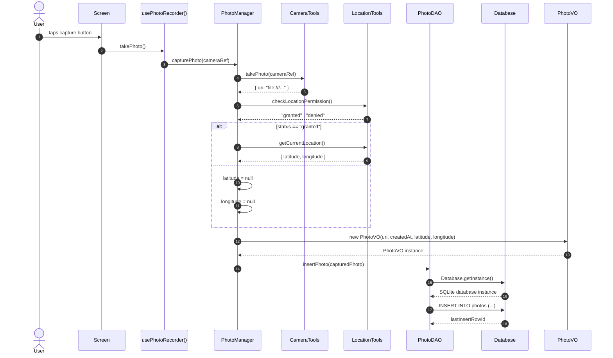
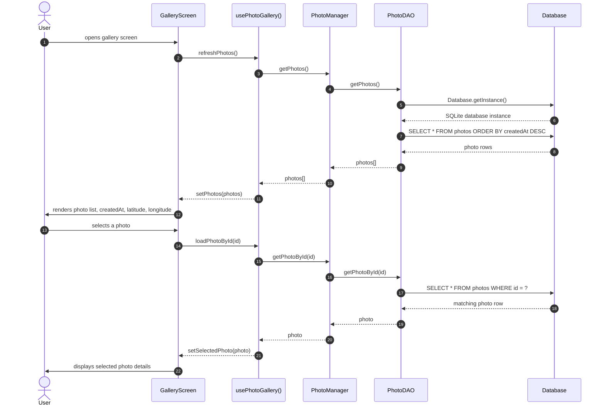

# Photo Recorder App

This application was created with Expo using the following command:

```bash
npx create-expo-app@latest photo-recorder-app --template blank
```

## Purpose

The app lets a user capture a photo and store it together with the capture metadata:

- photo URI
- created timestamp
- latitude
- longitude
- local persistence in SQLite

This is useful when the user needs to record a location-based observation and keep the information stored locally on the device.

## Features

- capture a photo with the device camera
- check and request camera permissions
- read the current geolocation when available
- save photo metadata and coordinates in a local SQLite database
- view saved photos in a gallery screen
- work as a lightweight offline local recorder app

## Tech Stack

- Expo SDK 54
- React Native
- Expo Router
- Expo Camera
- Expo Location
- Expo SQLite
- Jest + jest-expo for tests

## Expo Router

This app uses Expo Router for file-based navigation instead of a custom navigation library. The main routes are defined in the `app/` folder:

- `app/index.js` is the home screen for the photo recorder
- `app/gallery.js` is the gallery screen
- `app/_layout.js` provides the shared app shell and layout styling used by the routes

Each file in `app/` acts as a route entry, and the layout wraps the screens so common UI such as the menu or shell remains consistent across screens.

## Project structure

```text
photo-recorder-app/
├── app/
│   ├── _layout.js
│   ├── gallery.js
│   └── index.js
├── hooks/
│   ├── usePhotoGallery.js
│   └── usePhotoRecorder.js
├── models/
│   ├── dao/
│   │   └── PhotoDAO.js
│   ├── database/
│   │   └── Database.js
│   ├── managers/
│   │   └── PhotoManager.js
│   ├── tools/
│   │   ├── CameraTools.js
│   │   └── LocationTools.js
│   └── valueobjects/
│       └── PhotoVO.js
├── screens/
│   ├── GalleryScreen.js
│   └── PhotoRecorderScreen.js
├── __tests__/
│   └── models/
│       ├── dao/
│       │   └── PhotoDAO.test.js
│       └── managers/
│           └── PhotoManager.test.js
├── App.js
├── app.json
├── index.js
├── package.json
├── README.md
└── assets/
```

## Architecture

The application follows a simple layered flow:

```text
Screen -> Hook -> Manager -> DAO -> SQLite database
```

This keeps UI code focused on presentation and moves the business logic to the manager layer.

### Main responsibilities

- Screen: render UI and display state
- Hook: coordinate interaction and state updates
- Manager: orchestrate capture, permissions, and persistence logic
- DAO: read/write data to SQLite
- PhotoVO: validate photo metadata and coordinates

## Prerequisites

Before running the app, make sure you have installed:

- Node.js 20+
- npm
- Expo CLI
- Android Studio with an Android emulator, or
- Xcode with an iOS simulator (macOS only), or
- Expo Go on a physical device

## Install dependencies

```bash
npm install
```

## Run the app

This project targets Expo SDK 54 and uses native modules such as `expo-camera`, `expo-location`, and `expo-sqlite`.

### Start Expo Metro

```bash
npx expo start --clear
```

### Run on iPhone simulator (macOS only)

```bash
npx expo start --ios
```

Or run the native iOS app build directly:

```bash
npx expo run:ios
```

### Run on Android emulator

```bash
npx expo start --android
```

Or run the native Android build directly:

```bash
npx expo run:android
```

### Run on a physical device with Expo Go

```bash
npx expo start
```

Then scan the QR code with Expo Go.

## Native-module troubleshooting

If you see errors such as missing native modules or SQLite setup issues, rebuild the native app instead of only starting the JS bundler:

```bash
npx expo install expo-sqlite
npx expo prebuild --clean
npx expo run:ios
```

or

```bash
npx expo install expo-sqlite
npx expo prebuild --clean
npx expo run:android
```

## Local SQLite database

The app stores captured records locally in SQLite so the data remains on the device even when used offline.

The database is initialized lazily by `Database.getInstance()`, and the photos table stores:

- `id`
- `uri`
- `createdAt`
- `latitude`
- `longitude`

## Capture flow

The capture lifecycle is as follows:

1. the screen calls `takePhoto()` from the recorder hook
2. the hook delegates to `PhotoManager.capturePhoto()`
3. the manager requests/validates camera permissions
4. the manager gets the current location if permission is granted
5. a `PhotoVO` is created with the captured metadata
6. the DAO inserts the record into the SQLite database
7. the gallery loads the saved records from the database



## Gallery flow

The gallery lifecycle is as follows:

1. the gallery screen loads and requests the current photo list
2. the hook asks the manager to read the stored records
3. the manager delegates to the DAO to fetch all photos
4. SQLite returns the persisted rows
5. the screen renders the photo metadata and preview image



## Testing

Run the test suite with:

```bash
npm test
```

Run the manager-focused tests with:

```bash
npx jest __tests__/models/managers/PhotoManager.test.js --runInBand
```

## Notes

- The app is intentionally designed as a local-first photo recorder.
- The gallery screen displays the saved metadata, not only the image.
- The codebase keeps the UI layer minimal and moves logic into hooks and manager classes.

## Creation command

```bash
npx create-expo-app@latest photo-recorder-app --template blank
```

This project was initialized from that blank Expo template and then extended with the photo capture and local persistence flow.

    DAO->>VO: new PhotoVO(photo.uri, photo.createdAt, photo.latitude, photo.longitude)
    VO-->>DAO: PhotoVO instance
    DAO->>DAO: persistedPhoto.id = result.lastInsertRowId
    DAO-->>Manager: PhotoVO { id: 1, uri, createdAt, latitude, longitude }

    Manager->>Manager: this.currentPhoto = savedPhoto
    Manager-->>Hook: savedPhoto
    Hook-->>Screen: savedPhoto
    Screen-->>User: renders photo and coordinates
```

### Exact methods involved

- `PhotoManager.capturePhoto(cameraRef)`
  - Parameters: `cameraRef`
  - Returns: `savedPhoto` when persistence succeeds, or `capturedPhoto` when no DAO is configured, or `null` when no photo URI is returned.

- `PhotoManager.setCurrentPhoto(uri, createdAt = new Date().toISOString(), latitude = null, longitude = null)`
  - Parameters: `uri`, `createdAt`, `latitude`, `longitude`
  - Returns: a `PhotoVO` instance.

- `PhotoDAO.insertPhoto(photo)`
  - Parameters: `photo` (a `PhotoVO` instance)
  - Returns: a `PhotoVO` instance with `id` assigned from `result.lastInsertRowId`.

- `PhotoVO.constructor(uri, createdAt = new Date().toISOString(), latitude = null, longitude = null)`
  - Parameters: `uri`, `createdAt`, `latitude`, `longitude`
  - Returns: a validated `PhotoVO` instance.

- `Database.getInstance()`
  - Parameters: none
  - Returns: the singleton SQLite database instance, creating it if it does not exist.

## Project structure

```bash
photo-recorder-app/
├── App.js
├── AGENTS.md
├── CLAUDE.md
├── README.md
├── app.json
├── index.js
├── package.json
├── package-lock.json
├── assets/
├── docs/
├── hooks/
│   └── usePhotoRecorder.js
├── models/
│   ├── dao/
│   │   └── PhotoDAO.js
│   ├── database/
│   │   └── Database.js
│   ├── managers/
│   │   └── PhotoManager.js
│   ├── tools/
│   │   ├── CameraTools.js
│   │   └── LocationTools.js
│   └── valueobjects/
│       └── PhotoVO.js
├── screens/
│   └── PhotoRecorderScreen.js
├── __tests__/
│   ├── models/
│   │   ├── dao/
│   │   │   └── PhotoDAO.test.js
│   │   ├── database/
│   │   │   └── Database.test.js
│   │   ├── managers/
│   │   │   └── PhotoManager.test.js
│   │   └── tools/
│   │       ├── CameraTools.test.js
│   │       └── LocationTools.test.js
│   └── ...
├── ios/
├── android/
├── .expo/
├── .claude/
├── .git/
├── .gitignore
└── node_modules/
```

## Notes

This project is intended as a local photo + GPS recorder and is designed for testing and development in Expo-based environments. If you plan to add more features later, you can extend it with:

- photo gallery view
- delete saved records
- export data as JSON
- sync to a backend service

## Useful commands

```bash
npm install
npx expo start
npx expo start --android
npx expo start --ios
```
