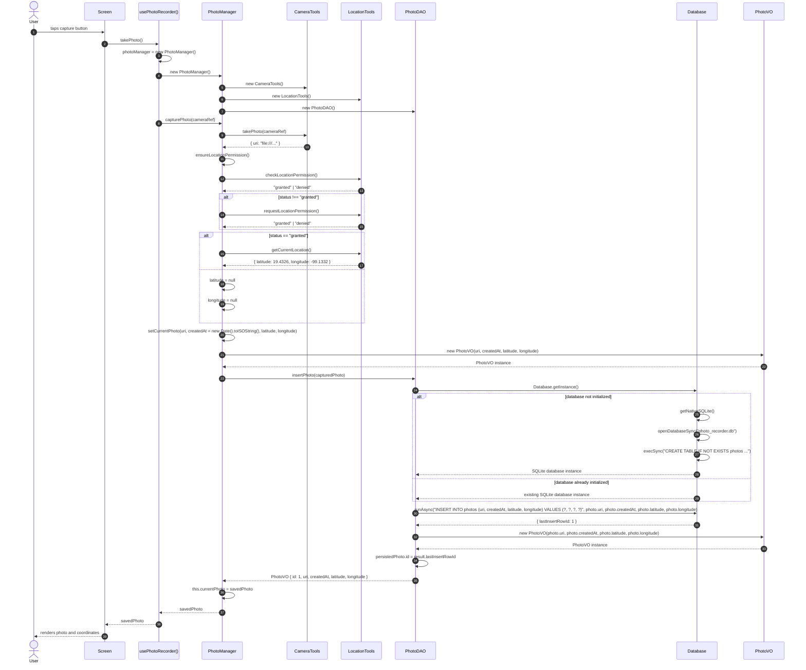

# Photo Recorder App

This application was created with Expo using the following command:

```bash
npx create-expo-app@latest photo-recorder-app --template blank
```

## Purpose

The purpose of this app is to let the user take a photo from the application and record the following information:

- the captured photo
- the latitude
- the longitude
- the timestamp of the capture
- the data stored locally in a SQLite database

This is useful for scenarios where the user needs to document a location and attach a photo to that record, with the information stored locally on the device.

## Features

- Capture a photo using the device camera
- Retrieve current geolocation coordinates
- Save photo metadata and coordinates in a local SQLite database
- View saved photo entries locally on the device
- Work as a lightweight offline local recorder app

## Tech Stack

- Expo
- React Native
- SQLite local database
- Expo Camera
- Expo Location
- Expo SQLite

## Prerequisites

Before running the app, make sure you have installed:

- Node.js 20+ recommended
- npm or Yarn
- Expo CLI
- Android Studio with an Android emulator, or
- Xcode with an iOS simulator (for macOS only), or
- Expo Go app on a physical device

## Install dependencies

From the project root:

```bash
npm install
```

## Run the application

This project targets Expo SDK 54. The app is designed to run with Expo tooling and native modules such as `expo-camera`, `expo-location`, and `expo-sqlite`.

### 1) Install dependencies

```bash
npm install
```

### 2) Start the Expo development server

```bash
npx expo start --clear
```

This starts Metro and prints a QR code plus a list of available run options.

### 3) Run on iPhone simulator (macOS required)

1. Open Xcode.
2. Start an iPhone simulator from Xcode or the Simulator app.
3. In the project root, run:

```bash
npx expo start --ios
```

This launches the app in the selected iPhone simulator.

If you are using a native build or need the app to include the native SQLite module properly, use:

```bash
npx expo run:ios
```

This creates and launches the iOS native app build before running it.

### 4) Run on Android emulator

1. Open Android Studio.
2. Start an Android emulator or device.
3. Run:

```bash
npx expo start --android
```

This launches the app in the Android emulator.

If you need a native Android build with all native modules available:

```bash
npx expo run:android
```

### 5) Run on a physical device with Expo Go

1. Install Expo Go on your phone.
2. Start the Metro server:

```bash
npx expo start
```

3. Scan the QR code with Expo Go.

This is useful for quick testing, but native features such as SQLite and camera permissions may behave differently than on a clean native build.

### 6) If the simulator says the native module is missing

If you see errors like `Cannot find native module 'ExpoSQLite'`, it usually means the app is running in an environment where the native module has not been linked or rebuilt properly.

Use the native build flow instead of only the JS bundler:

```bash
npx expo install expo-sqlite
npx expo prebuild --clean
npx expo run:ios
```

or

```bash
npx expo install expo-sqlite
npx expo prebuild --clean
npx expo run:android
```

This ensures the native modules are generated and available for the simulator or emulator.

## Local SQLite database

The app stores its captured records locally using SQLite, so data remains on the device even when the app is used offline.

## Object lifecycle and capture flow

The object creation order is important in this app:

1. `usePhotoRecorder()` creates a `PhotoManager` instance.
2. The `PhotoManager` constructor creates the default `CameraTools`, `LocationTools`, and `PhotoDAO` dependencies.
3. A `PhotoVO` is only created when a photo is being assembled with metadata (`uri`, `createdAt`, `latitude`, `longitude`).
4. The database is not created in the UI layer; it is initialized lazily through `Database.getInstance()` inside `PhotoDAO.insertPhoto(photo)`.



### Exact methods involved

- `PhotoManager.capturePhoto(cameraRef)`
  - Parameters: `cameraRef`
  - Returns: `savedPhoto` when persistence succeeds, or `capturedPhoto` when no DAO is configured, or `null` when no photo URI is returned.

- `PhotoManager.setCurrentPhoto(uri, createdAt = new Date().toISOString(), latitude = null, longitude = null)`
  - Parameters: `uri`, `createdAt`, `latitude`, `longitude`
  - Returns: a `PhotoVO` instance.

- `PhotoDAO.insertPhoto(photo)`
  - Parameters: `photo` (a `PhotoVO` instance)
  - Returns: a `PhotoVO` instance with `id` assigned from `result.lastInsertRowId`.

- `PhotoVO.constructor(uri, createdAt = new Date().toISOString(), latitude = null, longitude = null)`
  - Parameters: `uri`, `createdAt`, `latitude`, `longitude`
  - Returns: a validated `PhotoVO` instance.

- `Database.getInstance()`
  - Parameters: none
  - Returns: the singleton SQLite database instance, creating it if it does not exist.

## Project structure

```bash
photo-recorder-app/
├── App.js
├── AGENTS.md
├── CLAUDE.md
├── README.md
├── app.json
├── index.js
├── package.json
├── package-lock.json
├── assets/
├── docs/
├── hooks/
│   └── usePhotoRecorder.js
├── models/
│   ├── dao/
│   │   └── PhotoDAO.js
│   ├── database/
│   │   └── Database.js
│   ├── managers/
│   │   └── PhotoManager.js
│   ├── tools/
│   │   ├── CameraTools.js
│   │   └── LocationTools.js
│   └── valueobjects/
│       └── PhotoVO.js
├── screens/
│   └── PhotoRecorderScreen.js
├── __tests__/
│   ├── models/
│   │   ├── dao/
│   │   │   └── PhotoDAO.test.js
│   │   ├── database/
│   │   │   └── Database.test.js
│   │   ├── managers/
│   │   │   └── PhotoManager.test.js
│   │   └── tools/
│   │       ├── CameraTools.test.js
│   │       └── LocationTools.test.js
│   └── ...
├── ios/
├── android/
├── .expo/
├── .claude/
├── .git/
├── .gitignore
└── node_modules/
```

## Notes

This project is intended as a local photo + GPS recorder and is designed for testing and development in Expo-based environments. If you plan to add more features later, you can extend it with:

- photo gallery view
- delete saved records
- export data as JSON
- sync to a backend service

## Useful commands

```bash
npm install
npx expo start
npx expo start --android
npx expo start --ios
```
